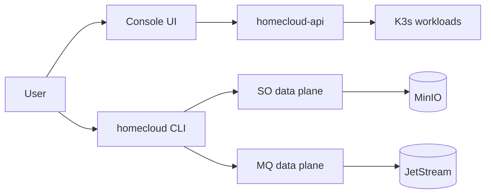

# Overview

HomeCloud runs on your own infrastructure (K3s homelab or cloud) with a single **apex domain** (e.g. `holab.abrdns.com`).

## Architecture at a glance



## Authentication models

=== "Console (JWT)"

    Used for UI operations: create buckets, queues, IAM users, view billing.

    ```bash
    homecloud login --username alice
    homecloud queues list
    ```

=== "Access Key (data plane)"

    Used for SO/MQ/Secrets runtime APIs — like AWS IAM access keys.

    ```bash
    homecloud configure
    # or per-command:
    homecloud --access-key-id HCAK... --secret-access-key ... so ls my-bucket
    ```

!!! note "Account ID is automatic"
    Access Keys are scoped to an account. The CLI resolves `account_id` automatically — you never pass it manually.

## Next steps

1. [Create an account](accounts.md)
2. [Generate an Access Key](access-keys.md)
3. [Install the CLI](../cli/install.md)
