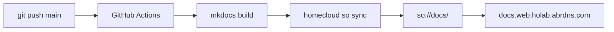

# Documentation site

This site is built with [MkDocs Material](https://squidfunk.github.io/mkdocs-material/) and deployed to HomeCloud SO static website hosting.

**URL:** [https://docs.web.holab.abrdns.com](https://docs.web.holab.abrdns.com)

## How it works



## One-time homelab setup

### 1. Create bucket `docs`

Console → Storage → Create bucket → name: `docs`

### 2. Enable static website

Console → bucket `docs` → Website tab:

| Setting | Value |
|---------|-------|
| Enabled | ✓ |
| Index document | `index.html` |
| Error document | `404.html` |

MkDocs Material generates `index.html` and `404.html` automatically.

### 3. Public read (website)

Bucket policy — allow public `so:GetObject`:

```json
{
  "Version": "2012-10-17",
  "Statement": [
    {
      "Effect": "Allow",
      "Principal": "*",
      "Action": ["so:GetObject"],
      "Resource": ["arn:holab:so:::docs/*"]
    }
  ]
}
```

### 4. CI Access Key

Create IAM Access Key with:

```json
{
  "Version": "2012-10-17",
  "Statement": [
    {
      "Effect": "Allow",
      "Action": ["so:ListBucket", "so:PutObject", "so:DeleteObject"],
      "Resource": ["arn:holab:so:::docs", "arn:holab:so:::docs/*"]
    }
  ]
}
```

### 5. GitHub secrets (`homecloud-docs` repo)

| Secret | Value |
|--------|-------|
| `HOMECLOUD_ACCESS_KEY_ID` | `HCAK…` |
| `HOMECLOUD_SECRET_ACCESS_KEY` | secret |
| `HOMECLOUD_APEX` | `holab.abrdns.com` |

## Local development

```bash
pip install -r requirements.txt
mkdocs serve
# → http://127.0.0.1:8000  (English)
# → http://127.0.0.1:8000/he/  (Hebrew)
```

Source pages live under `docs/en/` and `docs/he/` (Hebrew falls back to English when a page is not translated yet). Theme and chrome match the HomeCloud console (`docs/stylesheets/homecloud.css`).

## Manual deploy

```bash
mkdocs build
homecloud so sync ./site so://docs/ --delete
```

## CI workflow

See [`.github/workflows/deploy.yml`](https://github.com/HomeCloudLab/homecloud-docs/blob/main/.github/workflows/deploy.yml) — runs on every push to `main`.
