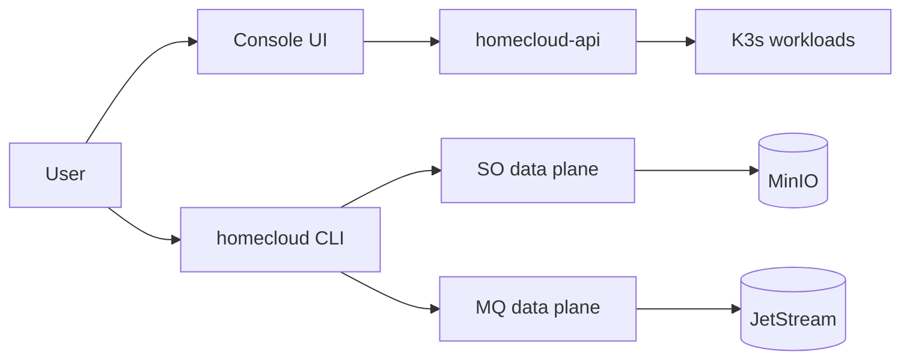

# סקירה כללית

HomeCloud רץ על התשתית שלך (homelab ב-K3s או ענן) עם **apex domain** יחיד (למשל `holab.abrdns.com`).

## ארכיטקטורה במבט מהיר



## מודלי אימות

=== "Console (JWT)"

    לפעולות בממשק: יצירת buckets, תורים, משתמשי IAM, צפייה ב-billing.

    ```bash
    homecloud login --username alice
    homecloud queues list
    ```

=== "Access Key (data plane)"

    ל-API של SO/MQ/Secrets בזמן ריצה — כמו מפתחות גישה של AWS IAM.

    ```bash
    homecloud configure
    # או לכל פקודה:
    homecloud --access-key-id HCAK... --secret-access-key ... so ls my-bucket
    ```

!!! note "Account ID אוטומטי"
    מפתחות גישה משויכים לחשבון. ה-CLI מזהה את `account_id` אוטומטית — אין צורך להעביר אותו ידנית.

## השלבים הבאים

1. [יצירת חשבון](accounts.md)
2. [יצירת Access Key](access-keys.md)
3. [התקנת CLI](../cli/install.md)
