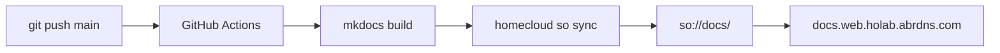

# אתר התיעוד

אתר זה נבנה עם [MkDocs Material](https://squidfunk.github.io/mkdocs-material/) ומתפרסם לאירוח אתר סטטי ב-SO של HomeCloud.

**כתובת:** [https://docs.web.holab.abrdns.com](https://docs.web.holab.abrdns.com)

## איך זה עובד



## הגדרה חד-פעמית ב-homelab

### 1. יצירת bucket בשם `docs`

Console ← Storage ← Create bucket ← שם: `docs`

### 2. הפעלת אתר סטטי

Console ← bucket‏ `docs` ← לשונית Website:

| הגדרה | ערך |
|---------|-------|
| Enabled | ✓ |
| Index document | `index.html` |
| Error document | `404.html` |

‏MkDocs Material מייצר את `index.html` ואת `404.html` אוטומטית.

### 3. קריאה ציבורית (אתר)

מדיניות bucket — התרת `so:GetObject` ציבורי:

```json
{
  "Version": "2012-10-17",
  "Statement": [
    {
      "Effect": "Allow",
      "Principal": "*",
      "Action": ["so:GetObject"],
      "Resource": ["arn:holab:so:::docs/*"]
    }
  ]
}
```

### 4. Access Key ל-CI

צרו IAM Access Key עם:

```json
{
  "Version": "2012-10-17",
  "Statement": [
    {
      "Effect": "Allow",
      "Action": ["so:ListBucket", "so:PutObject", "so:DeleteObject"],
      "Resource": ["arn:holab:so:::docs", "arn:holab:so:::docs/*"]
    }
  ]
}
```

### 5. GitHub secrets (מאגר `homecloud-docs`)

| Secret | ערך |
|--------|-------|
| `HOMECLOUD_ACCESS_KEY_ID` | `HCAK…` |
| `HOMECLOUD_SECRET_ACCESS_KEY` | secret |
| `HOMECLOUD_APEX` | `holab.abrdns.com` |

## פיתוח מקומי

```bash
pip install -r requirements.txt
mkdocs serve
# → http://127.0.0.1:8000  (אנגלית)
# → http://127.0.0.1:8000/he/  (עברית)
```

עמודי המקור נמצאים תחת `docs/en/` ו-`docs/he/` (עברית נופלת חזרה לאנגלית כשעמוד עדיין לא תורגם). ה-theme וה-chrome תואמים לקונסולת HomeCloud (`docs/stylesheets/homecloud.css`).

## פריסה ידנית

```bash
mkdocs build
homecloud so sync ./site so://docs/ --delete
```

## תהליך CI

ראו [`.github/workflows/deploy.yml`](https://github.com/HomeCloudLab/homecloud-docs/blob/main/.github/workflows/deploy.yml) — רץ בכל push ל-`main`.
